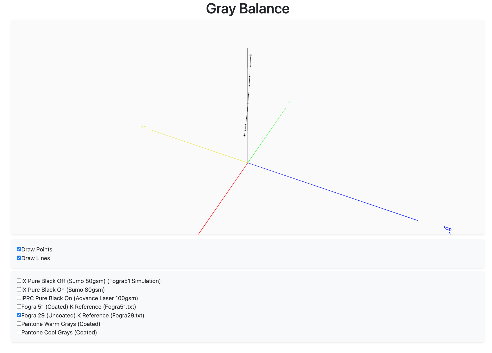

# Gray Balance Visualiser

This is a simple [P5JS](https://p5js.org/) sketch for visualising the gray balance of a printing process by plotting the Lab values in 3D space.

## Data

To obtain the points to visualise you need to print a grayscale ramp (I used 10% increments) and use a spectrophotometer to measure the Lab values of the grayscale wedges.

Once done, edit the `paper.js` file and add the Lab points you want to visualise.